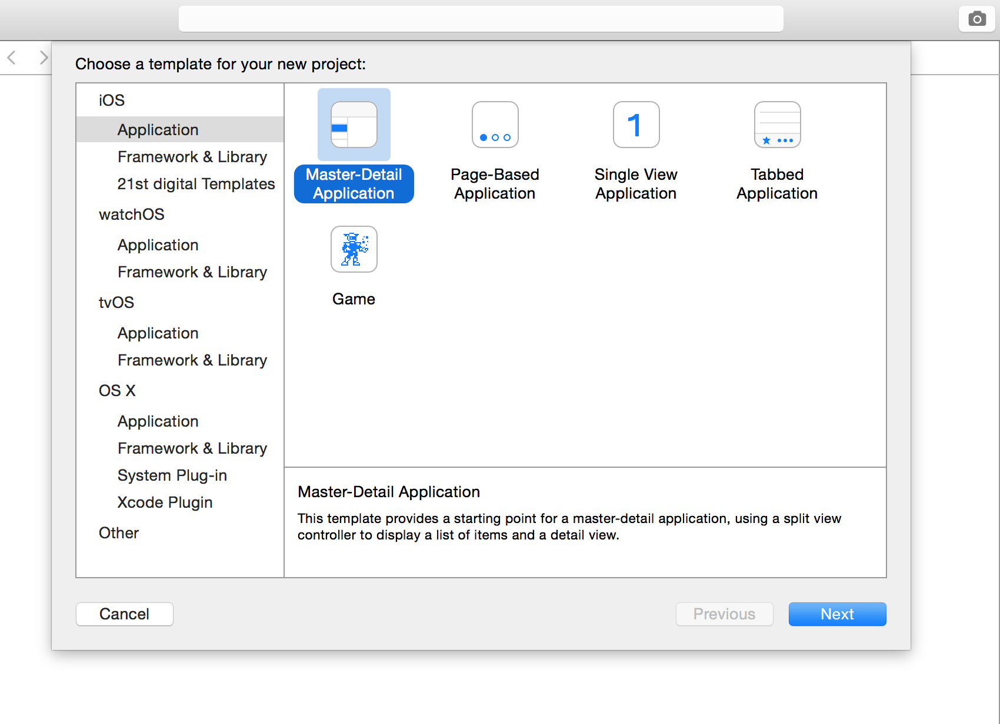
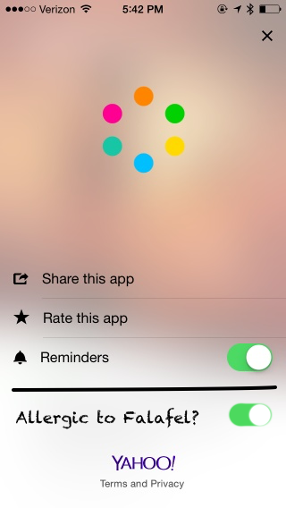
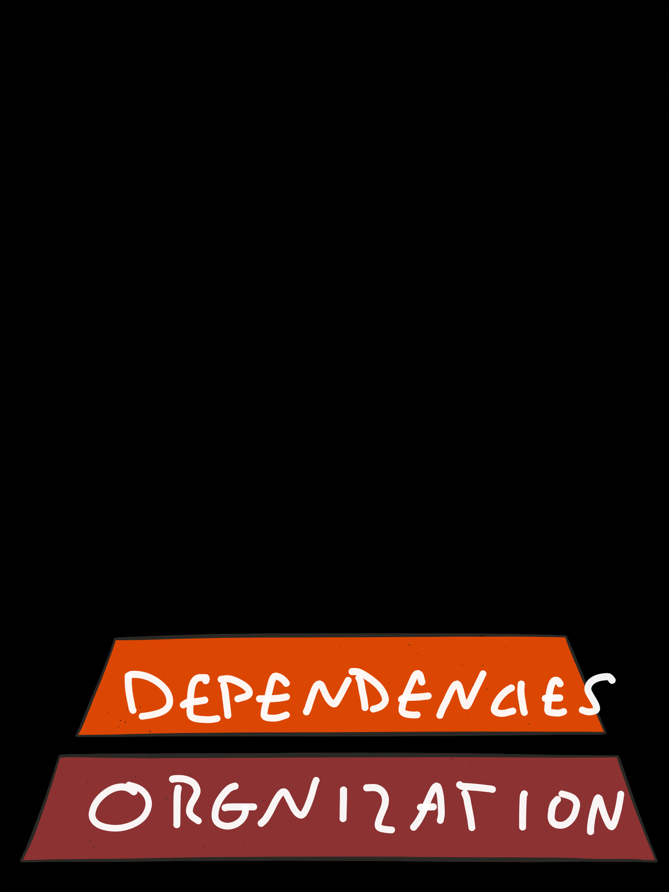
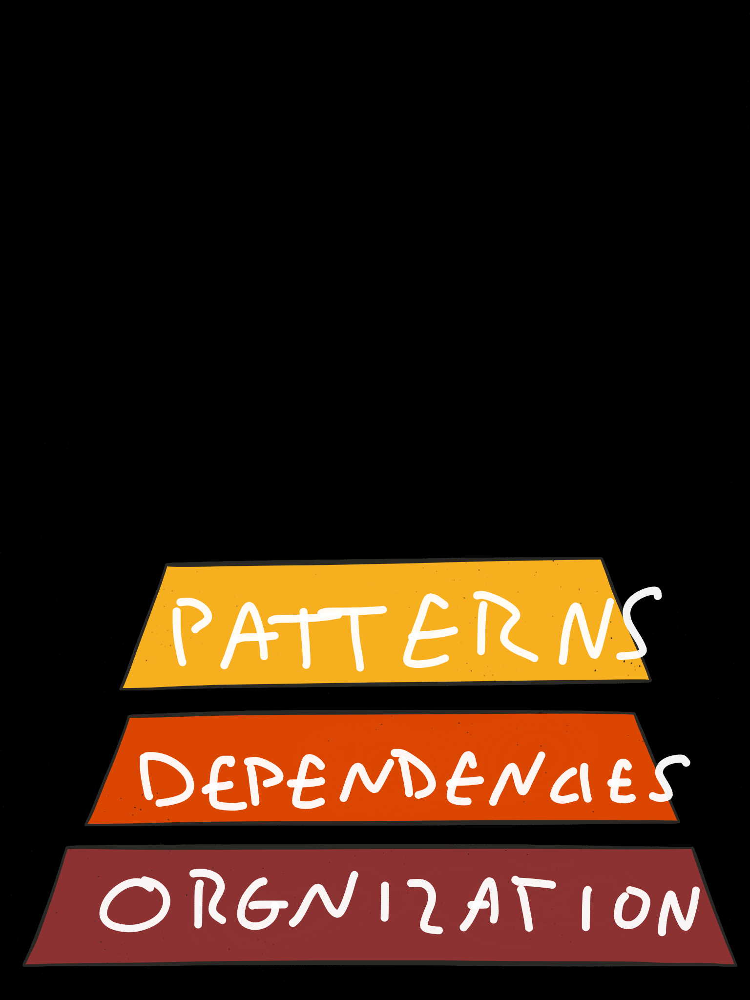
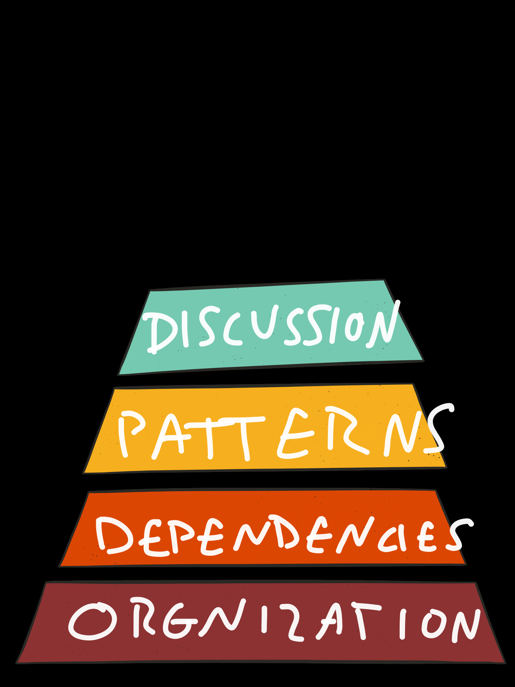
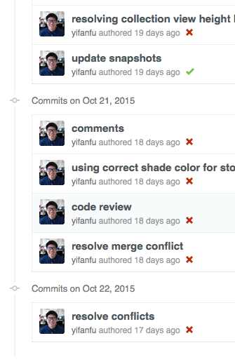
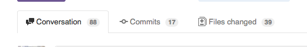
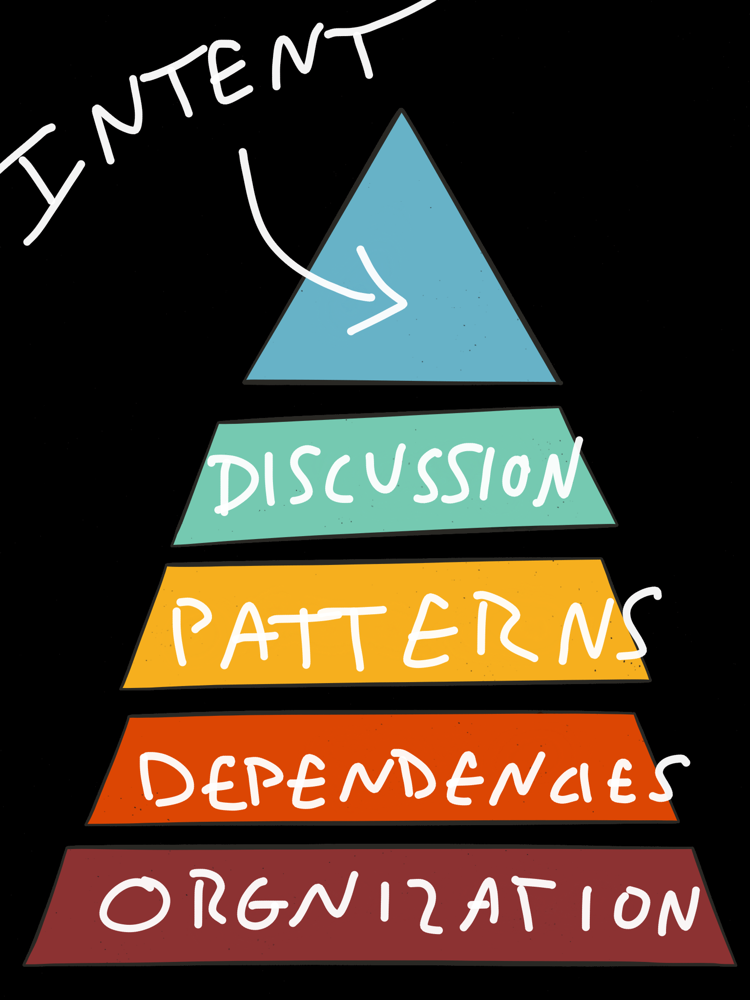

autoscale: true

The beginning



^ Starting a new project is such a great moment.

---


^ What do you name the repository? Your open your blank `Podfile` and your mind races with all the possibilities of which Swift JSON parser to use.

---


Green field

^ What an amazing time to be alive.

---


That’s not what this talk is about. Mostly.

^ So, your boss or client just gave you access to a repository with 100k lines of code. They ask you one of two things.

---




^ “We just need to add a button to this view to ask users if they are allergic to falafels. It should be really easy because it’s never been messed with since it was written 5 years ago.”

---


^ “We’ve finally got the budget to add all those awesome features we wanted to add before the old team all quit. We need you to clean this up. Just update it with some flat UI and make sure it works on the iPad too. Oh, we’re also going to localize for China. KFC did that and it worked out really well for them.”

---

#[fit] Understanding Other People’s Code

^ I think it’s important to talk about things like this because, I’ve looked at how I work and I spend a huge amount of time reading other code compared to writing code.

^ How many people write 1000 lines of a code a day? This should be very rare. How many people read 1000 lines of code? This is probably everybody in here.

^ I want to go through a process I use for picking up large code bases when you are in it for the long term.

---

Right. Take a deep breath.

---

What comes next?

^ I want to share the tools that I use to try to understand new code. To illustrate, I’m going to use the Artsy project “Eigen” because it’s a real and non-trivial codebase that is open so we can do things like this.

---


^ What are the directories named? How have the authors organized things? Do they organize by MVC objects, or by vertical concerns of the UI? Make sure you look at both the on disk structure as well as the Xcode groups...sometimes they are different.

^ This is useful as a reference for where you may go to look for things in the future.

---

```
tree -if | grep "\.m$" | xargs -n 1 wc -l  | sort -n
```

^ As part of this, I’m also looking for waypoints to start exploring. For that, I look for largest files by LoC.

---

```
     600 ./Networking/API_Modules/ARUserManager.m
     608 ./Models/API_Models/Partner_Metadata/Artwork.m
     638 ./View_Controllers/Core/ARArtistViewController.m
     871 ./View_Controllers/Contact/ARInquireForArtworkViewController.m
     935 ./Networking/ARRouter.m
    1403 ./App/ARAppDelegate+Analytics.m
   39643 total
```

---



^ There are 2 kinds of dependencies that are important here. The first is explicit dependencies like other Pods or libraries. This is important because it gives you an understanding of the difference in scope between this code, and all of it’s dependencies. There are very small projects that can easily pull in dozens of dependencies to leverage what they actually do.

---

### Depenedencies show the **true footprint** of your project

---

### Dependencies are :ghost:

^ They add leverage in the present, at the cost of adding technical debt. Over time, that debt can get out of control if you are too leveraged. Unlike some institutions, most of us are not “too big to fail.”

---

#### Build a small, but non-trivial, Rails app. An empty app has ~50 gem dependencies; yours will have 75-100. Go away for six months. Come back and update all of your dependencies. Your app no longer works.
#### - @garyburnhardt

^ You may be thinking, “Why are you showing us a quote about Rails apps? This isn’t RailSOHO.” Well, switch Rails with iOS and gem with pod and maybe lower the numbers involved...

^ This is absolutely true in almost any environment. We get an interesting twist because Apple only allows us to use old Xcode for a short period of time.

---

 is a dependency

^ The second set of dependencies are *implicit*. What version of iOS does it assume? Does it use ARC, blocks, and modern literals? Some of you may laugh at this, but it’s still pretty common to run into any of these. :)

---

Try compiling a Three20 app in Xcode7

^ You’ll say, “Dave, that’s kind of a contrived example. Three20 is years and years old.”

---

Try compiling a Swift 1 app in Xcode7

^ But we have other, less contrived, examples of dependencies being tricky.

^ This is why people still use C and Makefiles.

---

Try using an Xcode 7.1 playground in Xcode 7.0

---

For adding a new button. Just stop here.

^ For the cases where you are asked, “How long would it take you to add a button?” you can probably stop here.

^ For things with non-trivial additions. Let’s go further.

---



^ It’s important to remember that code doesn’t just come into existence. It has a creator...a person with interests and preferences and experience. When we write new code, that code is being created in the context of where we are now as an individual.

^ What does this mean for us, tonight? Well, just two ago, we didn’t have Swift. A bit farther back, and we didn’t have blocks and GCD. These are tools that change the core patterns of how we build things. If I made a new library today, it would be heavily influenced by the tools that I now have. 

^ These days, you’re less likely to see a huge set of delegates and more likely to see some callbacks. You’re also more likely to see things with a functional paradigm, or that have been influenced by Swift...even if it’s Objective-C.

---



^ For smaller code, it could be commit messages. More common these days to see this in PRs on github.

^ This is tacit knowledge about why things have to be the way they are. It’s also the point where negotiation happens and culture changes.

---




---



^ This is the hardest thing to grok, but can be the most useful. To go back to Three20 (because, I love/hate it) it was built in a time when iOS developers were coming from other places...lots of them were web developers. You can see in the code (and in the documentation) that it was designed as a tool to help web developers make the transition. It used concepts like “CSS” and “URL Navigation” to make people comfortable.

---

So, let’s get more practical about how to work with legacy code.

---

Read the tests. There are tests, right?

^ tests are about the assumptions of how things work
^ they expose parts of the mental model that the author used
^ they expose assumptions that may not be documented anywhere else
^ they show you which parts of the code the author cares about

---

Write new tests. Those are easy, right?

^ this will force you to read through the code
^ this will let you see which things are hard to understand (which exposes structure and patterns)
^ this will give you a chance to make the code better

---

The first test is the most important

^ I like to start with an incredibly simple test.

---

```obj-c
it(@"should be initializable", ^{
    DGHomeViewController *controller = [[DGHomeViewController alloc] init];
    expect(controller).toNot.beNil();
});

```

---

```obj-c
before(^{
    // Setup in-memory CoreData
});

it(@"should be initializable", ^{    
    DGHomeViewController *controller = [[DGHomeViewController alloc] init];
    expect(controller).toNot.beNil();
});
```

---

```obj-c
it(@"should be initializable", ^{
    UIWindow *window = [[UIWindow alloc] initWithFrame:[UIScreen mainScreen].bounds];

    DGBigViewController *controller = [[DGBigViewController alloc] init];
    expect(controller).toNot.beNil();
    window.rootViewController = controller;
    [window makeKeyAndVisible];

    expect([controller isViewLoaded]).to.beTruthy();
});
```

---

```obj-c
before(^{
    // Setup in-memory CoreData
    // Stub News HTTP requests
    // Stub Image HTTP requests
    // Setup a fake User
});
```

---

Where are all these implicit dependencies coming from?

---

```obj-c
+ (instancetype)sharedDoodad {
    static DoodadManager *_sharedDoodad = nil;
    static dispatch_once_t onceToken;
    dispatch_once(&onceToken, ^{
        _sharedDoodad = [[DoodadManager alloc] init];
    });

    return _sharedDoodad;
}
```

---

### At least have a way to reset it.

```obj-c


static DoodadManager *_sharedDoodad = nil;
static dispatch_once_t onceToken;

+ (void)setSharedDoodad:(DoodadManager *)doodad {
    if (!doodad) {
        _sharedDoodad = nil;
        onceToken = 0;
    } else {
        _sharedDoodad = doodad;
    }
}

+ (instancetype)sharedDoodad {
    dispatch_once(&onceToken, ^{
        _sharedDoodad = [[DoodadManager alloc] init];
    });

    return _sharedDoodad;
}
```

---

### Better: Move from static singleton to attached to AppDelegate

---

### Best: Move from AppDelegate to Dependency Injection

---

### Use a style based marker for things that you have updated

#### e.g. braces on methods or modern literals.

---

#### I said legacy, but...

### this applies to understanding **new** dependencies too

---

#[fit] Understanding Other People’s Code

^ To circle back to where we started, there’s 2 things that stand out. 

---


---

#[fit] Understanding Other People

^ Most of what I look at comes down to understanding the context of the author. Where were they in their career when they wrote this? What patterns and tools were commonplace? What libraries from which languages were they comfortable with that provided inspiration?

---

### No code is perfect.

---


---

### All code has a story.

---


---

### Everything you've ever thought about **other people's code**, is something that other people have thought about **your code**.

---


---


@dbgrandi -->

---

Links

```
https://www.reddit.com/r/programming/comments/2343yu/the_setup_gary_bernhardt_i_dont_want_more_or/
```
